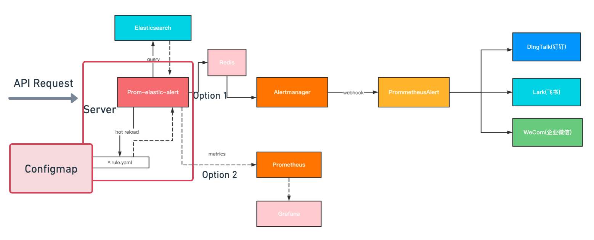
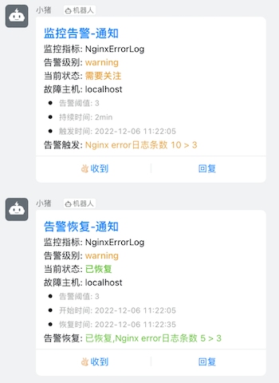
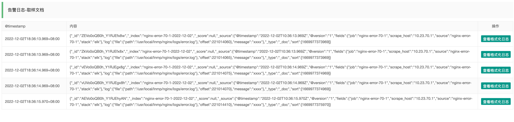
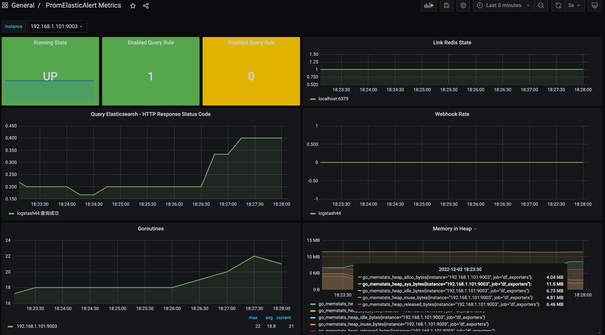

English | [中文](./README_ZH.md)

elastic-alert is an alerting component based on querying Elasticsearch.

## Motivation

This project [elastic-alert](https://github.com/openinsight-proj/elastic-alert) mainly solves there are no more independent log alerting open source components to choose from in the  Elastic stack market.

Although we have used the [Elastalert](https://github.com/Yelp/elastalert) project before, but this project is no longer maintained, and we encountered some problems during actual use:
- Elastalert are written in Python, and poor performance sometimes causes alarm delays
- Elastalert's alarm convergence, alarm aggregation, convergence and other functions are weak
- Elastalert operation data cannot be integrated into the Prometheus monitoring system

This project was inspired by [Elastalert](https://github.com/Yelp/elastalert)

## Features and benefits

- Written in Golang, cross-platform, small size, performance is advantageous enough
- A complete API is provided
- It does not realize alarm aggregation, convergence, grouping, etc., which is the advantage of alertmanager, and there is no need to impl those by yourself. Introduced [PrometheusAlert](https://github.com/feiyu563/PrometheusAlert) to implement multiple types of alerts
- Built-in exporter, you can access the Prometheus monitoring system to view the current component running status, data, etc
- Support for Elasticsearch7, Elasticsearch8(In the Future)
- Built-in Grafana panel JSON files

## Architecture diagram

## Sample alarm

### DingTalk notifications

### Alert details

### Grafana panel

### Quick Start

[Docker Compose](./CONTRIBUTING.md)

### Docs

more docs [Usage](docs/document.md)

### License

prom-elastic-alert is under the Apache 2.0 license. See the [LICENSE](LICENSE) file for details.